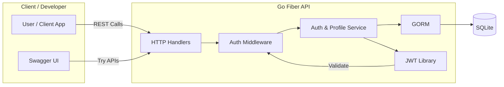
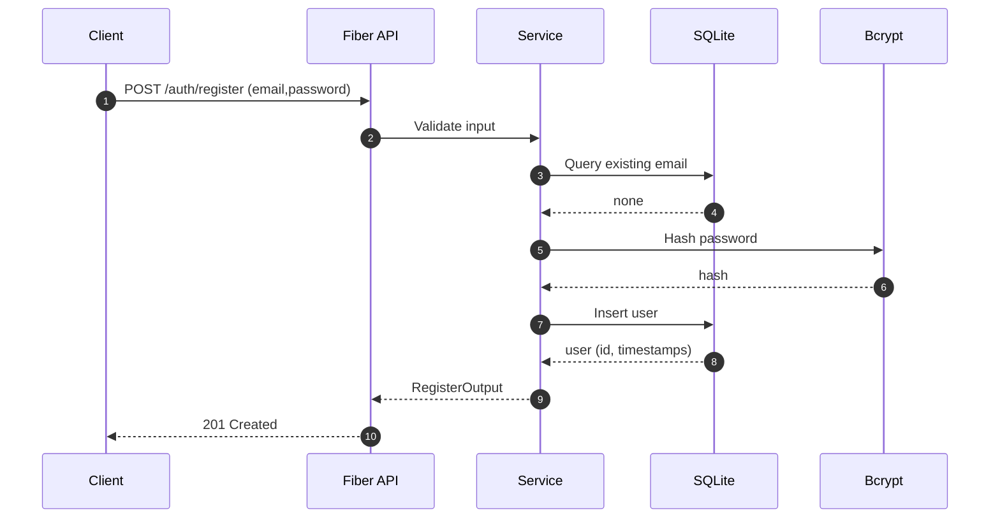
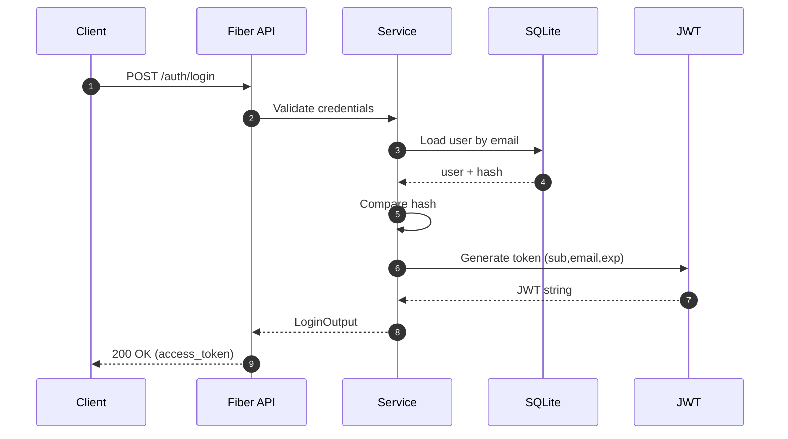
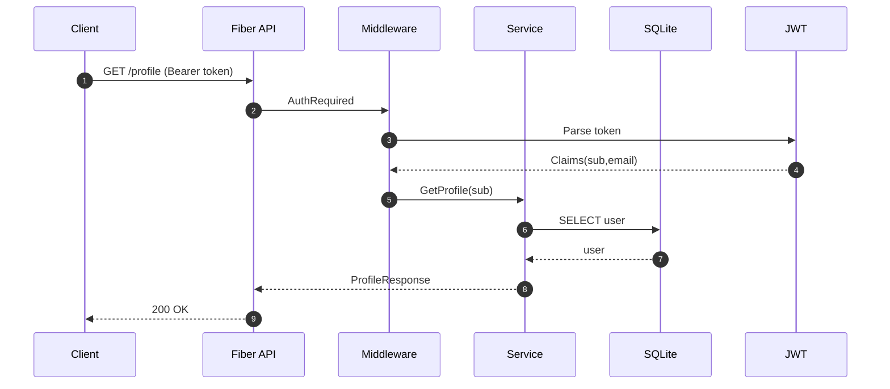
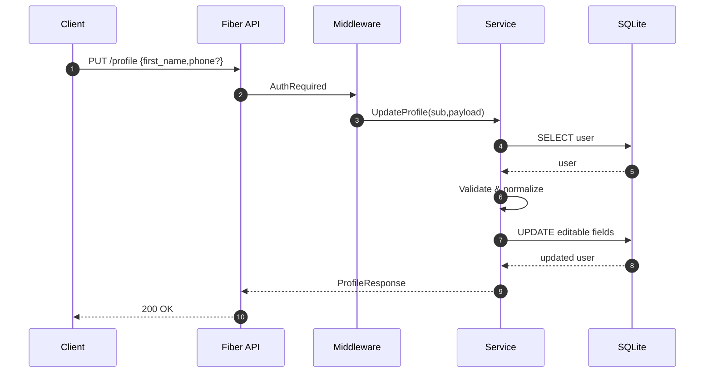

# Product Requirements Document (PRD)
ระบบ Backend สำหรับ Authentication + Documentation + SQLite (Go Fiber)

## Goals
- ให้บริการ REST API สำหรับสมัครสมาชิก (Register) และเข้าสู่ระบบ (Login)
- ออก JWT Token สำหรับใช้งานใน endpoint ที่ต้อง authentication
- ใช้ SQLite เป็นฐานข้อมูล (local dev) พร้อมโครงสร้างรองรับการขยาย
- มีเอกสาร Swagger ครอบคลุมทุก route
- ปฏิบัติตามแนวทางการจัดเก็บข้อมูลที่ปลอดภัย (รหัสผ่านแฮช, ไม่เก็บ plaintext)

## Out of Scope (เวอร์ชันแรก)
- Refresh token / token rotation
- Role-based access control (RBAC)
- Social login
- Rate limiting
- Password reset flow

---

## 1. Database

### 1.1 Engine
- ใช้ SQLite (ไฟล์: data/app.db)
- เหตุผล: เบา, เหมาะกับ workshop / prototype, ไม่ต้อง setup server
- ใช้ไลบรารี: `gorm.io/gorm` + `gorm.io/driver/sqlite`

### 1.2 Schema (Initial)

Table: users
- id (uint, PK, auto increment)
- email (string, unique, not null, indexed)
- password_hash (string, not null)
- created_at (datetime)
- updated_at (datetime)
- last_login_at (nullable datetime)
- is_active (boolean, default true)
- first_name (string, nullable)            <-- added for Profile
- last_name (string, nullable)             <-- added for Profile
- phone (string, nullable, indexed)        <-- added for Profile (unique optional future)
- membership_level (string, default 'Bronze')  <-- added (enum: Bronze|Silver|Gold|Platinum)
- membership_code (string, unique, nullable)   <-- added (e.g. LBK001234)
- points (integer, default 0)              <-- added (remaining points)
- joined_at (datetime, nullable)           <-- added (วันที่สมัครสมาชิก shown in UI)

(ไม่เก็บ: plaintext password, ไม่เก็บ salt แยก ถ้าใช้ bcrypt ซึ่งจัดการภายใน)

### 1.3 การเชื่อมต่อ
- เปิด connection ตอน start
- ตรวจสอบว่าไฟล์โฟลเดอร์ data/ มีอยู่ (หากไม่มีก็สร้าง)
- Auto-migrate ด้วย GORM (จะเพิ่มคอลัมน์ใหม่อัตโนมัติเมื่อ deploy ฟีเจอร์ Profile)

### 1.4 Security / Compliance Notes
- Password: ใช้ bcrypt (cost 12 หรือ >= default) หรือ argon2id (ถ้าเพิ่ม lib)
- ห้าม log ค่า password / hash
- ใช้ parameterized execution (GORM จัดการ)
- ป้องกัน enumeration: ข้อความ error login ควรเป็น generic เช่น "invalid credentials"
- ปิด debug SQL ใน production

### 1.5 Migration Strategy
- เวอร์ชันแรกใช้ GORM AutoMigrate
- หากขยาย: เพิ่มเครื่องมือ migration เช่น `golang-migrate` ภายหลัง

---

## 2. Authentication

### 2.1 Flow
1) Register: ผู้ใช้ส่ง email + password
2) ระบบตรวจสอบว่าไม่ซ้ำ → แฮชรหัสผ่าน → บันทึก
3) Login: ผู้ใช้ส่ง email + password
4) ตรวจสอบ hash → ออก JWT access token
5) Endpoint ที่ต้องป้องกันใช้ Bearer token

### 2.2 Password Policy (เบื้องต้น)
- ความยาวขั้นต่ำ: 8 ตัวอักษร
- แนะนำให้ client ตรวจรูปแบบ (ตัวพิมพ์เล็ก/ใหญ่/ตัวเลข) แต่ไม่บังคับในเวอร์ชันแรก

### 2.3 JWT
- ใช้ไลบรารี: `github.com/golang-jwt/jwt/v5`
- Algorithm: HS256
- Secret: จาก ENV variable: JWT_SECRET (ถ้าไม่มีให้ panic)
- Expiration: 15 นาที (access token)
- Claims:
  - sub: user id
  - email
  - exp
  - iat
  - iss: "workshop-be"
- (Optional ภายหลัง: jti สำหรับ revoke / audit)

### 2.4 Error Handling Standard
- 400: validation error
- 401: invalid credentials / missing token
- 409: email already exists
- 500: internal error
Response format:
{
  "error": {
    "code": "EMAIL_EXISTS",
    "message": "email already registered"
  }
}

### 2.5 Rate Limiting (Future)
- (ระบุเป็น backlog)

---

## 3. API Endpoints

### 3.1 Health
GET /healthz
200 OK → purely for liveness

### 3.2 Register
POST /api/v1/auth/register
Request:
{
  "email": "user@example.com",
  "password": "P@ssw0rd123"
}
Responses:
- 201:
  {
    "id": 1,
    "email": "user@example.com",
    "created_at": "2025-09-18T12:00:00Z"
  }
- 409: email exists
- 400: invalid payload

### 3.3 Login
POST /api/v1/auth/login
Request:
{
  "email": "user@example.com",
  "password": "P@ssw0rd123"
}
Responses:
- 200:
  {
    "access_token": "<jwt>",
    "token_type": "Bearer",
    "expires_in": 900
  }
- 401: invalid credentials

### 3.4 Me (Protected Example)
GET /api/v1/auth/me
Header: Authorization: Bearer <token>
200:
{
  "id": 1,
  "email": "user@example.com",
  "last_login_at": "2025-09-18T13:20:00Z"
}

### 3.5 Profile (ใหม่ตาม UI แนบ)
ใช้สำหรับแสดงและแก้ไขข้อมูลโปรไฟล์สมาชิก (หน้าจอบัตรสมาชิก + ส่วนแก้ไขข้อมูลส่วนตัว + ข้อมูลบัญชี)

#### 3.5.1 Fields ที่ Backend จัดการ
- membership_level (READ ONLY จากระบบ / ไม่ให้แก้ผ่าน endpoint PUT) ค่า enum: Bronze, Silver, Gold, Platinum
- membership_code (READ ONLY, สร้างครั้งเดียวตอน register หรือ provisioning ภายหลัง)
- first_name (editable)
- last_name (editable)
- phone (editable)
- email (READ ONLY ในหน้า profile เพื่อหลีกเลี่ยงผลกระทบ login; การเปลี่ยน email อยู่นอก scope)
- points (READ ONLY แสดงแต้มคงเหลือ)
- joined_at (READ ONLY วันที่สมัครสมาชิก / ถ้า null ใช้ created_at)

#### 3.5.2 Endpoint
1) GET /api/v1/profile
Response 200:
{
  "id": 1,
  "email": "somchai@example.com",
  "first_name": "สมชาย",
  "last_name": "ใจดี",
  "phone": "081-234-5678",
  "membership_level": "Gold",
  "membership_code": "LBK001234",
  "points": 15420,
  "joined_at": "2023-06-15T00:00:00Z"
}
Errors: 401 (UNAUTHORIZED)

2) PUT /api/v1/profile
Request (เฉพาะ field ที่แก้ไขได้):
{
  "first_name": "สมชาย",
  "last_name": "ใจดี",
  "phone": "081-234-5678"
}
Validation:
- first_name, last_name: optional; ถ้ามี length 1..100, trim whitespace
- phone: optional; รูปแบบไทย 10 หลัก (อนุญาต - หรือ เว้นวรรค) normalize เก็บเฉพาะตัวเลข 10 หลัก (เช่น 0812345678)
Behavior:
- Partial update (field ที่ไม่ส่งจะไม่เปลี่ยน)
- อัพเดต updated_at อัตโนมัติ
Response 200:
{ (structure เหมือน GET /api/v1/profile) }
Errors:
- 400 INVALID_PHONE / INVALID_NAME
- 401 UNAUTHORIZED
- 500 INTERNAL_ERROR

#### 3.5.3 Business Rules
- เปลี่ยน membership_level / points ผ่านระบบภายใน (future admin) ไม่ผ่าน endpoint นี้
- ถ้า membership_code เป็นค่าว่างตอนเรียก GET สามารถคืน null หรือไม่ส่งคีย์ (เลือกแบบส่ง null เพื่อให้ frontend handle)
- joined_at: หากว่างให้ frontend ใช้ created_at เป็น fallback
- phone เก็บค่าสุทธิ (digits only) แต่ response ส่งรูปแบบที่เก็บ (ไม่ re-format) => เวอร์ชันแรก simplest: ส่ง digits only; frontend format เอง

#### 3.5.4 Swagger Annotations (สรุป)
- @Summary Get profile / Update profile
- @Security BearerAuth ต้องเพิ่ม securityDefinitions:
  securityDefinitions:
    BearerAuth:
      type: apiKey
      name: Authorization
      in: header
  แล้วผูกกับ endpoints profile

#### 3.5.5 Error Codes (Profile)
- INVALID_PHONE
- INVALID_NAME
- UNAUTHORIZED
- INTERNAL_ERROR

---

## 4. Documentation (Swagger / OpenAPI)

### 4.1 Tools
- ใช้ `github.com/gofiber/swagger` + `swag` (github.com/swaggo/swag/cmd/swag)
- คำสั่ง generate: `swag init -g main.go -o internal/docs`
- เส้นทาง Swagger UI: GET /swagger/index.html
- ไฟล์ที่ต้องมี: docs swagger (auto-generated) ไม่แก้ไขตรง

### 4.2 Annotation ตัวอย่าง
ใน handler / main.go:
 // @Summary Register user
 // @Tags Auth
 // @Accept json
 // @Produce json
 // @Param request body RegisterRequest true "register"
 // @Success 201 {object} RegisterResponse
 // @Failure 400 {object} ErrorResponse
 // @Failure 409 {object} ErrorResponse
 // @Router /api/v1/auth/register [post]

 // @Summary Get profile
 // @Tags Profile
 // @Security BearerAuth
 // @Produce json
 // @Success 200 {object} ProfileResponse
 // @Router /api/v1/profile [get]

 // @Summary Update profile
 // @Tags Profile
 // @Security BearerAuth
 // @Accept json
 // @Produce json
 // @Param request body ProfileUpdateRequest true "profile update"
 // @Success 200 {object} ProfileResponse
 // @Failure 400 {object} ErrorResponse
 // @Router /api/v1/profile [put]

### 4.3 Definition Objects
- RegisterRequest
- RegisterResponse
- LoginRequest
- LoginResponse
- ErrorResponse
- UserMeResponse
- ProfileResponse (ใหม่)
- ProfileUpdateRequest (ใหม่)

---

## 5. Non-Functional Requirements

### 5.1 Performance
- รองรับ 50 RPS (workshop ใช้เครื่อง local)
- Response time เฉลี่ย < 200ms

### 5.2 Logging
- ใช้ log มาตรฐาน `log.Printf`
- ไม่ log password / token แบบเต็ม (สามารถ log prefix 5 ตัวแรกของ token ถ้าจำเป็น)

### 5.3 Configuration
ENV variables:
- PORT (default 3000)
- JWT_SECRET (ต้องกำหนด, ถ้าไม่มีก็ panic)
- APP_ENV (dev/prod) → ใช้กำหนด debug mode
- DB_PATH (default data/app.db)

### 5.4 Folder Structure (Proposed)
.
├── main.go
├── internal/
│   ├── db/
│   │   └── db.go
│   ├── auth/
│   │   ├── handler.go
│   │   ├── service.go
│   │   ├── model.go
│   │   └── jwt.go
│   ├── middleware/
│   │   └── auth.go
│   └── docs/ (generated)
├── pkg/
│   └── password/ (แยก hash logic)
├── data/ (sqlite file)
├── PRD.md
├── go.mod

---

## 6. Validation Rules

Register:
- email: required, รูปแบบต้อง valid RFC5322 (ใช้ regex)
- password: required, length >= 8
Login:
- email + password required
Profile Update:
- first_name / last_name: ถ้าส่งต้อง length 1..100 (UTF-8) และ trim
- phone: ถ้าส่ง ต้องมีตัวเลข 10 หลักหลัง normalize (ลบ non-digit) มิฉะนั้น INVALID_PHONE

---

## 7. Test Cases (High Level)

### 7.1 Register
- Success (ใหม่)
- Duplicate email
- Invalid email format
- Password too short

### 7.2 Login
- Success
- Email not found
- Wrong password

### 7.3 Auth Protected
- Missing token
- Invalid token signature
- Expired token

### 7.4 Profile
- GET profile success (มี/ไม่มี membership_code)
- GET profile unauthorized (no token)
- PUT profile success (เปลี่ยน first_name + phone)
- PUT profile partial (ส่งเฉพาะ last_name)
- PUT profile invalid phone
- PUT profile invalid name (length 0)
- PUT profile unauthorized
- PUT profile does not change read-only fields (membership_level, points)

---

## 8. Future Enhancements (Backlog)
- Refresh token / rotation
- Password reset (email OTP)
- Account lockout (brute force defense)
- Soft delete users
- Audit log
- Prometheus metrics
- Docker + Compose (SQLite volume)
- Upload profile avatar
- Points transaction history endpoint
- Admin endpoint ปรับปรุง membership_level / points

---

## 9. Acceptance Criteria (MVP)
- สามารถ register + login ได้
- ได้ JWT และ decode แล้วถูกต้อง
- /api/v1/auth/me ใช้ token แล้วได้ข้อมูลผู้ใช้
- Swagger UI แสดงทุก endpoint พร้อม schema
- ข้อมูลถูกเก็บในไฟล์ SQLite
- Password ไม่ถูกเก็บเป็น plaintext
- โค้ดรันผ่าน: go run main.go แล้วใช้งานตามที่ระบุ
- Profile: GET /api/v1/profile คืนค่าตาม spec และ PUT /api/v1/profile อัพเดต field ที่อนุญาตได้

---

## 10. Risks
- JWT secret เผลอ commit → ใช้ .env + .gitignore
- Race condition ตอน migrate (ต่ำมากใน single instance)
- Token ไม่ revoke ได้ (ยอมรับสำหรับ MVP)
- ข้อมูล phone format ไม่สอดคล้อง ถ้าไม่มี normalization (ลดด้วยการ normalize เก็บ digits)

---

## 11. Definition of Done
- โค้ด merge เข้าสาขาหลัก
- README อธิบายการรัน + swagger usage
- Swagger สร้างสำเร็จ
- Manual test ทุกกรณีหลักผ่าน
- ไม่มี secret ใน repo
- Profile endpoints พร้อมทดสอบตาม test cases 7.4

---

## 12. Diagrams (Context & Sequences)

### 12.1 System Context Diagram

คำอธิบาย: ผู้ใช้และ Swagger UI เรียก API → Handlers → Middleware ตรวจ Token → Service จัดการ Logic → GORM เข้าถึง DB และใช้ JWT สำหรับสร้าง/ตรวจสอบ Token.

### 12.2 Sequence Diagram: Register

### 12.3 Sequence Diagram: Login

### 12.4 Sequence Diagram: Get Profile

### 12.5 Sequence Diagram: Update Profile

### 12.6 Future Diagram Extensions
- Refresh Token Flow
- Password Reset Activity Diagram
- C4 Container Diagram (เมื่อมี external services)

---