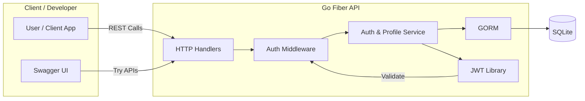
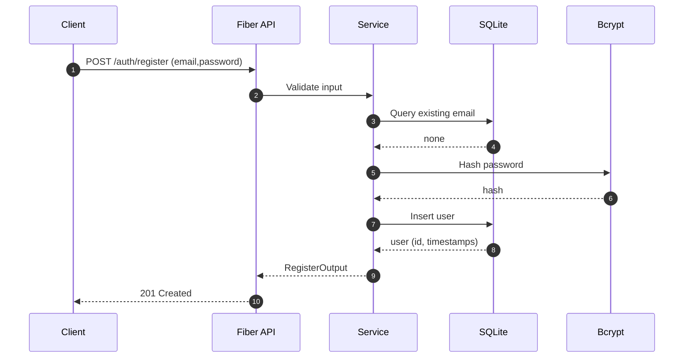
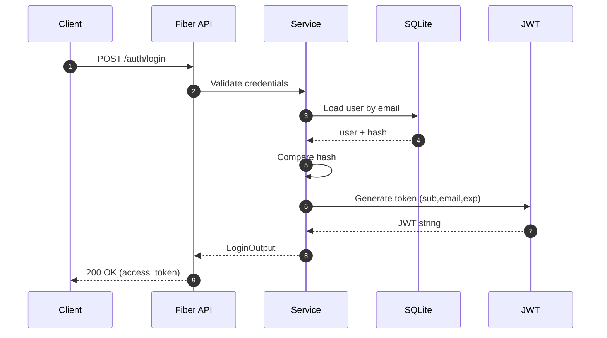
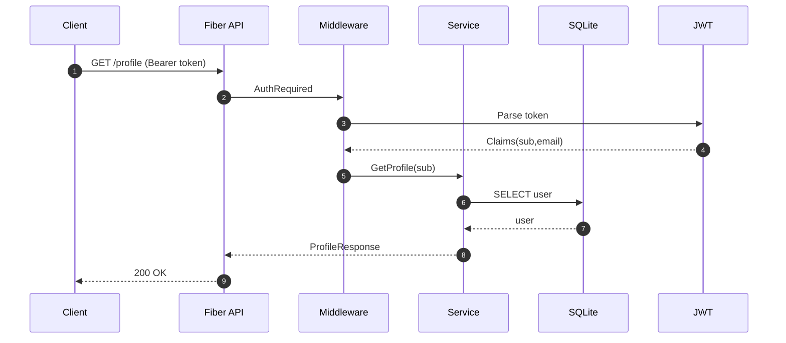
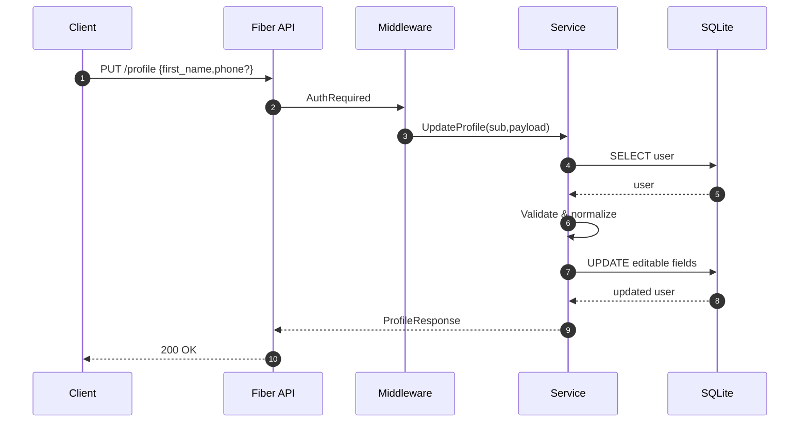

# Workshop BE (Fiber)

Simple Go Fiber backend with Authentication, JWT, SQLite, Swagger, and Profile feature.

## Prerequisites
- Go 1.22+
- (Optional) Air for hot reload

## Run
```bash
go run main.go
```
Then open: http://localhost:3000

Swagger UI: http://localhost:3000/swagger/index.html

## Environment Variables
- `PORT` (default 3000)
- `DB_PATH` (default data/app.db)
- `JWT_SECRET` (required in prod; dev fallback used if missing)
- `APP_ENV` (dev|prod, affects future behaviors)

Copy `.env.example` to `.env` and adjust.

## Hot Reload (Air)
Install once:
```bash
go install github.com/air-verse/air@latest
```
Run:
```bash
air
```

## Endpoints (Summary)
- GET `/healthz` - liveness
- POST `/api/v1/auth/register` - register (email, password)
- POST `/api/v1/auth/login` - login → JWT access token
- GET `/api/v1/auth/me` - current user (Bearer token)
- GET `/api/v1/profile` - profile (Bearer token)
- PUT `/api/v1/profile` - update editable profile fields (Bearer token)

## JWT Usage
After login you get:
```
{
  "access_token": "<jwt>",
  "token_type": "Bearer",
  "expires_in": 900
}
```
Include header:
```
Authorization: Bearer <jwt>
```

## Profile Update Rules
Editable: first_name, last_name, phone
Read-only: email, membership_level, membership_code, points, joined_at
Phone normalized to digits (10 digits required if provided).

## Swagger Generation
```bash
go install github.com/swaggo/swag/cmd/swag@latest
$(go env GOPATH)/bin/swag init -g main.go -o internal/docs
```

## SQLite Data
Database file stored at `data/app.db`. Auto-migration adds new columns.

## Build
```bash
go build -o workshop-be
```

## Graceful Shutdown
SIGINT/SIGTERM → shutdown server and close DB.

## Disclaimer
Dev fallback JWT secret is insecure; ensure `JWT_SECRET` set in production.

### System Context Diagram

คำอธิบาย: ผู้ใช้และ Swagger UI เรียก API → Handlers → Middleware ตรวจ Token → Service จัดการ Logic → GORM เข้าถึง DB และใช้ JWT สำหรับสร้าง/ตรวจสอบ Token.

### Sequence Diagram: Register


### Sequence Diagram: Login


### Sequence Diagram: Get Profile


### Sequence Diagram: Update Profile


### Future Diagram Extensions
- Refresh Token Flow
- Password Reset Activity Diagram
- C4 Container Diagram (เมื่อมี external services)

---